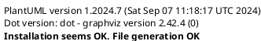

# Repository e-breuninger/git-beaver

Builds a curated open-source release of the GitBeaver utility as docker image. 

## Purpose

This repositories is used to build docker releases of GitBeaver including recommended plugins (see plugins.md). 
Plugins are frozen after the list has been processed, this prevents other beaver scripts from installing additional
(potentially harmful) plugins.

## About GitBeaver

## Build Overview

## Links

### Git Repositories
* GitBeaver core: https://github.com/g-bvr/core
* GitBeaverPlugins: https://github.com/g-bvr/
* This repository URL: https://github.com/e-breuninger/git-beaver/
* Derived Project (specific to google cloud platform): https://github.com/e-breuninger/git-beaver-gcp/

### Docker Images
* Used base docker image: https://hub.docker.com/r/gitbeaver/core/tags
* Created docker image: https://hub.docker.com/r/gitbeaver/release/tags
